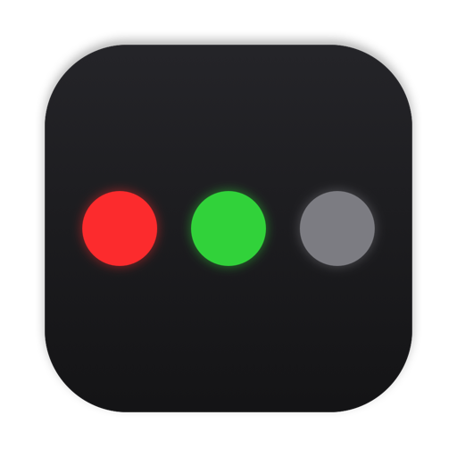
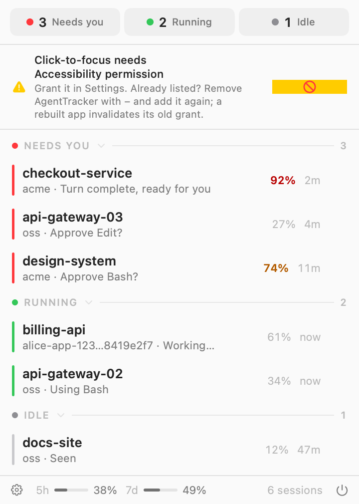
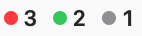
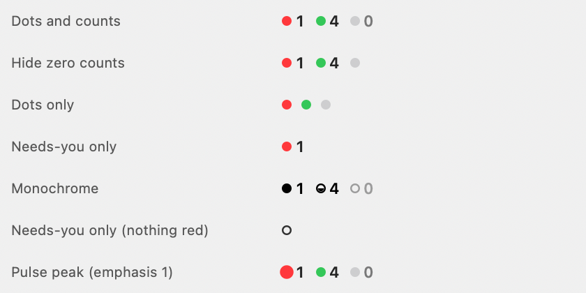
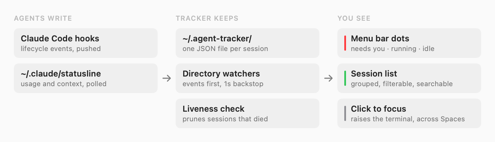

<div align="center">



# Agent Tracker

**Know which AI coding session needs you, without hunting through terminals.**

[](https://github.com/ThinkVelta/agent-tracker/releases/latest)
[](https://github.com/ThinkVelta/agent-tracker/releases/latest)
[](LICENSE)

<picture>
  <source media="(prefers-color-scheme: dark)" srcset="assets/dropdown-dark.png">
  
</picture>

</div>

## Why

Run more than one coding agent and the same question keeps coming back: *which
one is waiting on me?* Answering it means cycling through terminal windows
across Spaces, and the answer goes stale while you look.

Agent Tracker keeps it in your menu bar. Three dots, three counts:

<div align="center">
<picture>
  <source media="(prefers-color-scheme: dark)" srcset="assets/menubar-dark.png">
  
</picture>
</div>

- 🔴 **Needs you**: the turn finished, or it wants permission
- 🟢 **Running**: working right now
- ⚪ **Idle**: open, nothing pending

**Click a row and you land in that terminal**, across Spaces, and the session
stops asking for attention. Click a *dot* to open the list already filtered to
that state. Visit a session's terminal yourself and it clears on its own after a
few seconds.

No daemon, no telemetry, no account. Your agent CLIs report through the hook
mechanisms they already support, and the app reads plain JSON off disk.

## Install

Requirements: macOS 14 or later.

```sh
brew tap ThinkVelta/tap
brew trust --cask thinkvelta/tap/agent-tracker
brew install --cask agent-tracker
```

Homebrew 6 refuses to load casks from taps outside its own repositories until
you trust them, so without the middle line the install stops with *"Refusing to
load cask … from untrusted tap"*. That applies to every third-party tap, not
just this one, and trusting is per-machine.

Trusting the single cask rather than the tap is deliberate: `brew trust
thinkvelta/tap` also works, but it covers everything added to the tap in future,
including casks that do not exist yet.

Or download it by hand:

1. Download `AgentTracker-x.y.z.zip` from
   [the latest release](https://github.com/ThinkVelta/agent-tracker/releases/latest).
2. Unzip it and drag **AgentTracker.app** to `/Applications`.

Either way, launch it: a first-run window walks you through granting
Accessibility, connecting your agent CLIs, and starting at login.

> [!IMPORTANT]
> **The first launch is blocked, and the dialog's default button deletes the
> app.** This build is not yet notarized, so macOS shows *"AgentTracker Not
> Opened — Apple could not verify AgentTracker is free of malware"*, offering
> **Move to Trash** (highlighted) and **Done**.
>
> Click **Done**. Never Move to Trash.
>
> Then open **System Settings › Privacy & Security**, scroll to Security, and
> click **Open Anyway** next to *"AgentTracker was blocked to protect your
> Mac."* Launch the app again and it opens normally from then on.
>
> Only the first launch needs this. Notarized builds are coming, which removes
> the block entirely.

<details>
<summary><strong>Skipping that prompt from the terminal</strong></summary>

The block comes from the quarantine attribute macOS attaches to downloads.
Clearing it before the first launch avoids the dialog:

```sh
xattr -dr com.apple.quarantine -- /Applications/AgentTracker.app
```

That is a real Gatekeeper check you are switching off for this app, so only do
it if you are comfortable with that. The System Settings route above is the
safer one and reaches the same place.

On macOS 14 and earlier you could right-click the app and choose **Open**;
macOS 15 removed that shortcut.

</details>

<details>
<summary><strong>If click-to-focus stops working after an update</strong></summary>

Releases are signed with a stable certificate, so updating should keep your
Accessibility permission. If it is ever lost anyway, remove AgentTracker from
**System Settings › Privacy & Security › Accessibility** with **−**, then add it
again. Toggling the existing entry off and on does not help.

Builds you make yourself are ad-hoc signed unless you pass `CODESIGN_IDENTITY`,
and those *do* lose the grant on every rebuild. See Build from source.

</details>

Settings › About checks for newer releases. There is no auto-updater, and
nothing phones home on its own.

## What you get

**Click-to-focus.** The row you click raises that session's terminal window,
switching Spaces if it lives on another one, matched by the window's live
working directory and title, via the Accessibility API.

**Per-dot filtering.** Clicking the red dot opens the list showing only what
needs you. Clicking it again closes it. The chips at the top of the dropdown do
the same thing.

**A menu bar that stays out of the way.** Four icon modes, from counts on every
dot down to a single dot that appears only when something needs you, each of
them available in monochrome — which takes the menu bar's tint like a system
icon and tells the states apart by shape:

<div align="center">
<picture>
  <source media="(prefers-color-scheme: dark)" srcset="assets/icon-modes-dark.png">
  
</picture>
</div>

**Both agents, no configuration.** Claude Code reports through its hooks. Codex
is tracked live by reading its own session files; its `notify` hook is an extra
signal rather than a requirement.

## How it works

<div align="center">
<picture>
  <source media="(prefers-color-scheme: dark)" srcset="assets/architecture-dark.png">
  
</picture>
</div>

- **No daemon; event-driven at the core.** Agent CLIs push events through their
  native hook mechanisms; a tiny dependency-free Python script
  (`integrations/agent-tracker-hook.py`) translates each event into a per-session
  JSON state file, and the app watches those directories with dispatch
  sources/FSEvents. Two light timers back that up: a 1-second re-read (tunable
  in Settings) because FSEvents does not fire for appends to a file Codex holds
  open, and a 30-second `lsof` pass to notice when a `codex` process has gone.
- **Codex is tracked live without any config change**: the app also watches
  Codex's own rollout files in `~/.codex/sessions` (read-only) for
  `task_started`/`task_complete`/`turn_aborted` events, so Codex sessions show
  running/needs-you/idle states in real time. The `notify` hook is just an
  extra push signal on top. Codex multi-agent fan-out is collapsed into its
  root session: subagent threads get their own rollouts and even fire `notify`
  per subagent turn, and the app identifies and absorbs them (one session, one
  row) instead of showing a phantom "needs you" per finished subagent.
- **Dead sessions are pruned** automatically: each state file records the agent
  CLI's pid, and the app removes files whose process is gone (killed terminal,
  crash) even without a clean `SessionEnd`. Codex sessions are pruned via an
  `lsof`-based liveness check when their `codex` process exits.
- **Click-to-focus** uses the Accessibility API: it matches the session to a
  terminal window by title, then raises the window. macOS switches to its
  Space automatically. For Claude Code the exact window title is learned live
  from Claude's statusline payload: it carries `session_id` + `session_name`,
  and the terminal titles the window with that name behind a status glyph,
  which the matcher strips before comparing. Claude hands that payload to a
  statusline script and nowhere else, so the app reads it from either of two
  files — `~/.claude/statusline-last.json`, if your own script dumps its stdin
  there, or the copy the optional statusline wrapper below saves. Transcript
  task summaries ("✳ &lt;task summary&gt;") and working-directory fragments
  remain as fallbacks when neither exists.
- **A session waiting on a usage limit says so** instead of claiming it is
  ready. Codex reports its windows in the rollouts the app already tails;
  Claude reports a refusal into its transcript, and — if you opt into the
  statusline wrapper (`./install.sh --statusline`) — how much of the 5-hour and
  7-day windows is used and when each resets, *before* anything is refused.
  The wrapper occupies the single `statusLine` slot in `settings.json` and runs
  whatever was there before behind it, unchanged, recording it so uninstall
  puts it back. When the numbers are absent the app says it cannot tell, never
  that you have room left.
- **A finished turn is not always "needs you".** Claude's `Stop` fires when the
  assistant's turn ends, which is not the same as the work being done: a turn
  that backgrounded a shell is resumed when it finishes, and one that handed off
  to subagents or teammates is not over either. Claude publishes its own status
  for each of those (`shell` for background work, `busy` for delegated work), so
  a red row is re-derived as running until the session genuinely settles. It
  goes red once, at the end, instead of blinking on every hand-off.
- **A dialog is "needs you", whatever the hooks said.** A session showing a
  permission prompt, sandbox request or elicitation publishes `waiting`, and the
  row turns red quoting what Claude is blocked on ("input needed"). Acknowledged
  rows are left alone, so clearing a row by hand always sticks.

## Scheduled continues

A Claude Code session that stops on a usage limit can be armed, from the clock on
its row, to resume itself when the window resets. **Off by default** — it is the
only thing this app does that acts on a session rather than reporting on one, so
it has its own switch in Settings › General.

It needs two macOS permissions, and neither is ever asked for while a schedule is
firing — a prompt raised at 04:00 would sit unanswered and block the very delivery
it was meant to authorise. **Automation** (to talk to Ghostty) is requested when
you arm a schedule, or from Settings › General › *Permission to control Ghostty*,
which is also the way to grant it before you have ever been usage-limited.
**Notifications** are requested when you arm.

**It never wakes your Mac.** A schedule fires if the Mac is awake, or when it next
wakes, and is abandoned after 12 hours — by then the window it was armed for is
long gone and the session has probably been worked in since.

### What it refuses, and why that is most of the feature

Typing into the wrong session is the one thing here that cannot be undone, so
delivery refuses far more often than it fires, and always says why:

- **It can't tell which window is yours.** Ghostty exposes only an id, a title and
  a working directory per surface, and a session cannot report which surface it is
  in. If two windows share a title, both are refused. On one real machine, 2 of 9
  windows were uniquely identifiable. Running a session inside `tmux` would make
  it exact — that channel is not built yet.
- **The session isn't at a finished turn.** Return at an open permission prompt
  *approves the focused option*, so anything other than a completed turn is a hard
  refusal, re-checked from disk immediately before writing.
- **Something else is in the foreground.** In `vim`, "Continue" is
  change-to-end-of-line; at a `sudo` prompt it is submitted as a password. The
  agent must own the terminal (`pgid == tpgid`) before a single character is sent.
- **The window or process changed.** The pane recorded when you armed it is
  re-resolved before writing, and any disagreement aborts — a closed window, a
  reused one, a restarted Ghostty (surface ids are only meaningful within one run)
  or a recycled pid all refuse.
- **Only Ghostty, only Claude Code.** Terminal.app is excluded permanently: its
  entire scripting dictionary has one text-injecting command, `do script`, which
  *runs* what you give it. For Codex the app cannot tell "turn complete" from
  "approval prompt open", so the gate that makes a send safe has nothing to read.

Every attempt is recorded — sent, refused or failed. The most recent outcome for a
session shows in its scheduling panel (click the clock), and every one is written
to `~/.agent-tracker/logs/agent-tracker.log`. A feature that acts while nobody is
watching owes you a receipt.

**Notifications** are raised when something happened: a send, or a failure that
left a message sitting on a prompt. Refusals stay quiet — they are the normal case
here, not a malfunction, and one alert per refused schedule would be noise. They
are still in the log and the panel.

### Permission modes

Every mode Claude Code is known to run in is allowed, **including
`bypassPermissions`**. Auto-resume adds no capability such a session did not
already have — typing "Continue" yourself has exactly the same effect — so the
only thing that changes is that you are not at the keyboard when it starts. The
arming panel says so plainly for those modes rather than refusing. A mode this
version does not recognise *is* refused, because a mode nobody has seen cannot be
reasoned about.

## Known limitations

- **Several sessions in one repo look alike, and clicking one may open its
  sibling.** They share a directory, so they get the same row title, and their
  terminals report nothing that tells them apart. Clicking is better than a coin
  flip: the rows are spread across the candidate windows rather than all pointing
  at the first, and clicking again walks the rest, so two rows normally open two
  terminals. What is *not* guaranteed is that each one opens its own. Neither
  Ghostty nor Codex exposes a per-window identity that would settle it;
  `WindowIdentity` documents the four routes that were tried and closed.
- **Window matching is exact only when a title source exists.** Claude Code
  sessions get exact titles from the statusline payload, which means either your
  own script dumping it to `~/.claude/statusline-last.json` or the optional
  statusline wrapper; without one, matching falls back to transcript summaries
  and path fragments.
- **Claude's usage numbers come from the statusline and nowhere else.** Without
  the wrapper the app only learns of a limit once a request has already been
  refused, and most refusals do not say when the window resets. A `statusLine`
  set in a project's own settings shadows the user-level one, and nothing runs
  for `-p`, background agents, SDK sessions or an untrusted workspace, so those
  sessions report no usage at all.
- **Codex approval prompts don't surface as red yet**: rollouts don't record
  them; planned via Codex's native hooks engine.
- **A session inside tmux or screen can't be traced back to its window.** The
  multiplexer's server is not a child of the terminal that started it, and tmux
  overwrites the variable that would otherwise name the host, so click-to-focus
  only works there if exactly one terminal app is running.
- Terminal support is tested with **Ghostty**; iTerm2, Terminal.app, WezTerm and
  kitty are wired up but untested.

## Build from source

Requirements: the above, plus a Swift toolchain (Xcode or CLT) and Python 3.

```sh
# Build AgentTracker.app and install it into /Applications
make install

open /Applications/AgentTracker.app
```

The app is assembled straight from the SwiftPM build (`make app` if you only
want `dist/AgentTracker.app`), ad-hoc signed by default. Set
`CODESIGN_IDENTITY` to a Developer ID for a distributable build. Installing as
a bundle is what makes the Accessibility grant stick to the app (running via
`swift run` attributes it to your terminal) and enables start-at-login.

For development, `swift run AgentTracker` still works exactly as before.

Ad-hoc signing ties the Accessibility grant to that exact binary, so every
rebuild invalidates it. To make grants survive rebuilds, create a signing
identity once (Keychain Access → Certificate Assistant → Create a Certificate…
→ "AgentTracker Local", type *Code Signing*) and build with
`CODESIGN_IDENTITY="AgentTracker Local" make install`.

Prefer the command line for the agent hookup? `./install.sh` is the same
onboarding as a checkbox picker (non-interactive:
`./install.sh --agents claude,codex --yes`), orchestrating
`./integrations/install-claude-code.sh` and `./integrations/install-codex.sh`.
Everything is idempotent and configs are backed up before editing. To remove it
all again (hooks, the statusline wrapper, the installed app, its preferences),
run `./integrations/uninstall.sh` (add `--purge` to also delete
`~/.agent-tracker`).

Claude's usage windows are a separate opt-in, because capturing them means
occupying the one `statusLine` slot in `~/.claude/settings.json`: the picker
asks, or pass `--statusline` (`--no-statusline` to skip the question). The
wrapper saves the payload and then runs your previous statusline command with
the same bytes on its stdin, so what you see is unchanged; the displaced setting
is recorded under `~/.agent-tracker/` and restored on uninstall. An unrecognized
`statusLine` is left alone rather than replaced.

## Roadmap

- [ ] Homebrew tap: `brew install --cask agent-tracker`
- [x] **Scheduled continues** — arm a Claude Code session that stopped on a usage
      limit to resume itself when the window resets, from the clock on its row.
      Off by default (Settings › General). See below.
- [ ] macOS notifications on state changes (opt-in, respects Focus)
- [ ] Migrate the Codex integration to its native hooks engine (approval-request
      red states)
- [ ] More providers (Kimi, GLM, …), since the state file schema is provider-agnostic
- [x] Onboarding: install as .app + login item
- [x] Downloadable releases, signed so the Accessibility grant survives an update

## Support this project

Agent Tracker is free, MIT-licensed, and built in spare time. If it saves you
from hunting through terminal windows, you can say thanks:

- [**GitHub Sponsors**](https://github.com/sponsors/ThinkVelta): one-off or
  monthly, and GitHub takes no cut
- [**PayPal**](https://paypal.me/broekxruben): one-off, no account needed

Starring the repo, reporting a bug you hit, or telling someone who runs three
agents at once helps just as much and costs nothing.

## License

[MIT](LICENSE) · Made by [Ruben Broekx](https://github.com/RubenBroekx)
